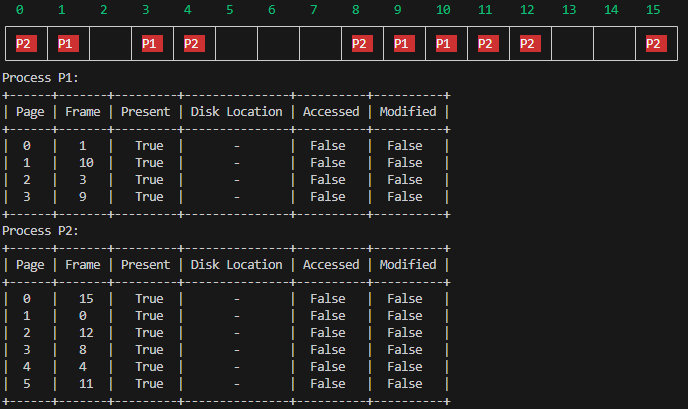

### 实验6：内存管理与虚拟内存
#### 实验目的
1. 理解分页式内存管理与请求分页式内存管理的原理与方法
2. 通过模拟分页式存储管理与虚拟内存，加深对分时系统内存管理的理解，进一步加深对操作系统虚拟性的认识
3. 理解页面置换算法的原理及其实现

#### 分页式存储管理
首先对物理内存分块，块大小和页面大小相等（比如都是1KB）：
```py
from typing import Dict
class PageMemory:
    def __init__(self, physical_size=1024, page_size=1):
        # 按顺序i给物理块编号
        self.frames = [MemoryFrame(i) for i in range(physical_size // page_size)] 
        self.page_size = page_size
        # page tables - 各进程的页表用字典存储(现实中是放在内存中)
        self.page_tables:Dict[str, PageTable] = {}
    
    def create_page_table(self, pid, num_pages):
        # 为进程创建页表
        pt = PageTable()
        for i in range(num_pages):
            ...
        # 创建后填入page_tables
        self.page_tables[pid] = pt

    def allocate_frame(self, pid):
        # 为页分配物理块
        ...
        # 返回物理块号
        return frame_index
```
+ 页表
操作系统会为每个进程生成一张页表，由页表可以找到页表由页表项(entries)构成：
    ```py
    class PageTable:
        def __init__(self):
            self.entries:Dict[int, PageEntry] = {}
    ```
+ 页表项
基本分页式管理，页表项一般由物理块号和控制位构成，为了支持*虚拟存储*，需要增加存在位`p`,访问位`A`，外存地址等内容：
    ```py
    class PageEntry:
        def __init__(self):
            self.present = False
            self.frame = None
            self.disk_location = None 
            self.accessed = False
            self.modified = False
    ```
+ 创建页表`create_page_table(self, pid, num_pages)`
此函数为进程创建页表，给页表中的每一项属性进行赋值，如`self.frame=2`表面此页对应的物理块号为`2`，`self.present = True`, 表明此页已加载到内存。为简单起见，`disk_location`不做硬性要求，感兴趣的同学可以去实现。

+ 内存物理块分配
  简单起见，我们为每一页随机分配一个空闲物理块。

+ 可视化
这里的`MemoryFrame`类的实现能更好地进行物理块的可视化：
    ```py
    class MemoryFrame:
        def __init__(self, frame_number):
            self.frame_number = frame_number
            self.free = True
            self.pid = None
    ```
    配合可视化函数可以输出
    ```py
    mm = PageMemory(physical_size=16, page_size=1)
    mm.show_memory()
    for pid, pt in mm.page_tables.items():
        print(f"Process {pid}:")
        mm.show_page_table(pid)
    ```

#### 虚拟存储
基于上面的分页系统，不同之处在于：
1. 加载进程时，不把所有页面加载到内存中，为了简化模拟，关注页面置换本身，采用固定分配(设置`allocate_num_frame`的数值)局部置换模式，且开始只将每个进程的前`allocate_num_frame`页加载到内存：如若`allocate_num_frame=3`，则`0,1,2`页加载到内存。
2. 发生缺页时，需要进行缺页处理`handle_page_fault(self, pid, page)`和页面置换`page_replacement(self, pid, page)`
3. 测试时会提供进程的页面访问顺序，所以需要有`access_page(self, pid, page)`函数
4. 需要有支持页面置换算法的数据结构的定义。
5. 进行缺页率计算的变量`self.page_faults`,`self.page_hits`
6. 对与外存的互动操作不做要求。例如，如果页表项的`modified=True`,此页被换出时，需要写回外存。
```py
class RequestPageMemory:
    def __init__(self, physical_size=1024, page_size=1,
                 allocate_num_frame=3, page_replacement_algorithm="FIFO"):
        #frames
        self.frames = [MemoryFrame(i) for i in range(physical_size // page_size)]
        self.page_size = page_size
        # pre-load number of pages/frames per process
        self.allocate_num_frame = allocate_num_frame
        
        # page tables
        self.page_tables:Dict[str, PageTable] = {}
        
        # simulate disk storage
        self.disk = []
        
        # data structure for page replacement
        # 1. algorithm
        self.page_replacement_algorithm = page_replacement_algorithm
        # 2. for FIFO 
        self.fifo_
        # 3. for LRU
        self.lru_

        # efficiency metrics
        self.page_faults = 0
        self.page_hits = 0
    
    def create_page_table(self, pid, num_pages):
        pass

    def allocate_frame(self, pid):
        pass
        return frame_index
    
    def handle_page_fault(self, pid, vpage):
        pass

    def page_replacement(self, pid, page):
        pass
    
    def access_page(self, pid, page):
        pass

    def get_page_fault_rate(self):
        pass
```
##### 页面置换
发生缺页时若系统内存已满，需要选一个页面换出，把要访问的页面调入内存，这就是页面置换。我们实现FIFO和LRU：
+ FIFO (first come first out): 换出最先装入内存的页面
+ LRU （least recently used）: 换出最近最久未被访问的页面

#### 测试
给定两个进程P1,P2以及他们的页面需求和页面访问顺序：
```py
    processes = {
        'P1': {'pages': 4, 'page_access': [0, 3, 2, 1, 3, 1, 0, 1, 3, 2, 1, 2, 3, 2, 1, 3]},
        'P2': {'pages': 6, 'page_access': [0, 3, 0, 4, 2, 3, 0, 3, 2, 1, 2, 0, 1, 5, 0, 1]},
    }
```
1. 分页存储：为每个进程创建页表，之后打印页表和可视化内存即可
   ```py
   mm = PageMemory(physical_size=16, page_size=1)
   for pid, info in processes.items():
       pt = mm.create_page_table(pid, info['pages'])
   mm.show_memory()
   for pid, pt in mm.page_tables.items():
       print(f"Process {pid}:")
       mm.show_page_table(pid)
   ```
   运行结果：
   
2. 请求分页(虚拟存储)：打印页面访问前后的页表，分别测试LRU和FIFO，并打印他们的缺页率。
   ```py
   vmm = RequestPageMemory(physical_size=6, page_size=1,
                            allocate_num_frame=3,
                            page_replacement_algorithm="LRU")
   # 遍历进程
   for pid, info in processes.items():
        # 遍历进程的访问页面
        for page in info['page_access']:
            vmm.access_page(pid, page)
        print(f"Page Faults Rate for Process {pid}: {vmm.page_faults}/{vmm.page_faults + vmm.page_hits} = {vmm.get_page_fault_rate():.2f}")
        vmm.page_faults = 0  # reset for next process
        vmm.page_hits = 0
   ```
#### Assignment
+ 以`memory.py`中的代码为基础进行开发,运行`run.py`来测试结果
+ 提交`memory.py`,`OS_Lab6_name.md`(基于`Lab6/templates.md`完成) 和 `OS_Lab6_name.pdf`(由`OS_Lab6_name.md`生成)；
+ **deadline: By the Friday of Week 14 (2025/12/05).**
+ submit to: xsun@gzhu.edu.cn, subject(邮件主题): Assignment-OS-Lab6